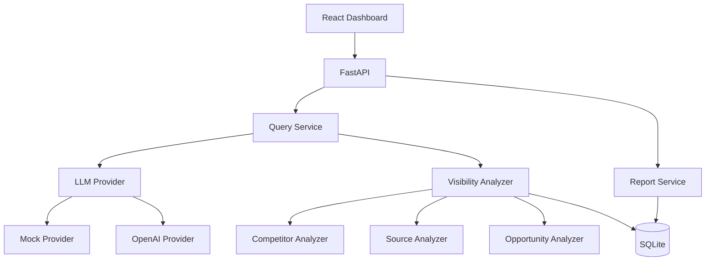

# AI Search Visibility & Recommendation Analyzer

A platform that measures **observable AI-search visibility** for Boutiqaat under controlled customer queries. It analyzes whether Boutiqaat is mentioned, recommended, ranked against competitors, and supported by sources — then surfaces potential improvement opportunities.

> **Important:** This system does NOT reverse-engineer ChatGPT, Google, or Perplexity ranking algorithms. It measures what AI assistants *say* when asked specific beauty retail questions.

## Problem

Customers increasingly ask AI assistants *"Which companies would you recommend for skincare in the Middle East?"* instead of searching Google. Boutiqaat needs to understand when and why it appears (or doesn't) in those AI-generated answers.

## Solution

This full-stack analyzer:

1. Loads realistic GCC beauty/skincare customer queries
2. Runs them through an LLM provider (offline mock or OpenAI)
3. Extracts structured recommendations, rankings, and sources
4. Computes visibility metrics and competitor comparisons
5. Generates opportunity signals with clear observation vs. inference language
6. Presents results in a dashboard and exportable reports

## Architecture



## Methodology

| Step | Approach |
|------|----------|
| Query selection | 34 realistic GCC beauty queries across discovery, transactional, comparison, product-specific, and local intents |
| AI runs | Structured JSON responses via mock (deterministic) or OpenAI |
| Entity detection | Deterministic normalization for Boutiqaat, boutiqaat.com, بوتيكات |
| Recommendation vs mention | Rule-based: "such as" = mention-only; numbered lists + recommend language = recommended |
| Ranking | Position from structured recommendation list only — never invented |
| Metrics | Transparent composite Visibility Score |
| Opportunities | Heuristic signals labeled as "potential reason" / "observed signal" |

## Metrics & Formulas

**Mention Rate** = (queries where Boutiqaat mentioned) / total runs × 100

**Recommendation Rate** = (queries where Boutiqaat recommended) / total runs × 100

**Average Position** = mean rank over runs where Boutiqaat is recommended

**Top-3 Rate** = (recommended runs with position ≤ 3) / total runs × 100

**Source Coverage** = (recommended runs with Boutiqaat-supporting sources) / recommended runs × 100

**Visibility Score** (per run, 0–100):

| Component | Weight |
|-----------|--------|
| Mentioned | 20% |
| Recommended | 40% |
| Top-3 when recommended | 25% |
| Boutiqaat source present | 15% |

Aggregate score = mean of per-run scores. This is a **custom diagnostic metric**, not an industry standard.

## Out of Scope

| Excluded | Why |
|----------|-----|
| Scraping ChatGPT/Perplexity UI | Against ToS; unreliable for production monitoring |
| Reverse-engineering ranking algorithms | Not possible or defensible |
| Custom ML model | Unnecessary complexity at this stage |
| Large SEO crawler | Out of scope; we analyze AI answers not web index |
| Multi-provider in v1 | Mock + OpenAI sufficient; architecture supports extension |
| PDF report generation | HTML + JSON + CSV cover reporting needs |

## Quick Start (Offline Mode — No API Key)

### Prerequisites

- Python 3.11+
- Node.js 18+ (optional, for the React frontend)

### Backend (built-in dashboard at http://localhost:8000)

```bash
cd backend
python -m venv .venv
.venv\Scripts\activate        # Windows
pip install -r requirements.txt
copy .env.example .env
uvicorn app.main:app --reload --port 8000
```

Open **http://localhost:8000**

> A React frontend is also included in `frontend/` (requires Node.js). The built-in dashboard at `:8000` provides the full experience.

## Using the Application

Follow these steps in the dashboard:

1. **Load Customer Queries** — click *Step 1* to load the GCC beauty/skincare question set, then scroll the list
2. **Run AI Analysis** — click *Step 2* and wait until analysis completes
3. **View Metrics** — review mention rate, recommendation rate, visibility score, intent chart, competitors, and opportunities
4. **Open a Query** — click any query run to inspect the full AI answer and Boutiqaat ranking
5. **Export Report** — click *Step 5* to download HTML, JSON, and CSV for stakeholders

### Offline configuration

Default `.env`:

```env
MOCK_MODE=true
```

No API key is required. Deterministic sample answers are used for reproducible analysis.

## Running With OpenAI

```env
MOCK_MODE=false
OPENAI_API_KEY=sk-...
OPENAI_MODEL=gpt-4o-mini
```

Restart the backend. Responses will be non-deterministic.

## Testing

```bash
cd backend
pytest -v
```

All tests run without an API key using deterministic logic.

## API Endpoints

| Method | Path | Description |
|--------|------|-------------|
| GET | `/api/health` | Health check |
| POST | `/api/queries/load-sample` | Load CSV queries |
| POST | `/api/analysis/run-full` | Run full analysis pipeline |
| POST | `/api/runs` | Batch AI runs |
| GET | `/api/analysis/overview` | Dashboard metrics |
| GET | `/api/analysis/competitors` | Competitor aggregates |
| GET | `/api/analysis/opportunities` | Opportunity cards |
| GET | `/api/analysis/runs/{id}` | Query detail |
| GET | `/api/reports/sample` | Generate report |

Full OpenAPI docs: **http://localhost:8000/docs**

## Sample Results

A sample report is included at `reports/sample_report.html`.

After a full analysis run, typical offline-mode results include:

- **~74% mention rate**
- **~49% recommendation rate**
- Top competitors: Sephora, Amazon, Noon, iHerb

A short product walkthrough video is available at `reports/demo_recording.webm`.

## Limitations

- LLM nondeterminism (except offline mock mode)
- Limited 34-query sample set
- Single provider in initial release
- No access to proprietary AI ranking internals
- Source availability varies by provider
- Opportunity signals are correlational, not causal

## Future Work

- Perplexity / Google AI APIs where supported
- Scheduled monitoring and trend charts
- Larger query sets by geography and category
- A/B testing content changes against visibility

## Tech Stack

- **Backend:** FastAPI, SQLAlchemy, Pydantic, OpenAI SDK
- **Frontend:** React, TypeScript, Vite, Tailwind CSS, Recharts
- **Database:** SQLite

## Project Structure

```
├── backend/app/              # API, services, models, dashboard
├── frontend/src/             # React frontend
├── data/sample_queries.csv   # Customer query set
├── reports/                  # Sample report and walkthrough video
└── README.md
```
